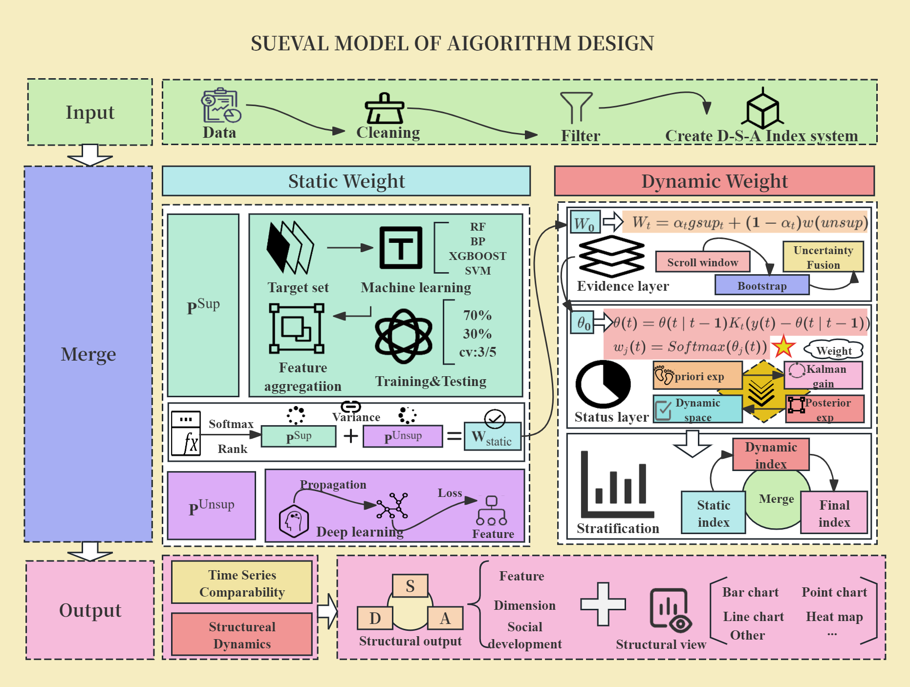

# SUEVAL: Supervised–Unsupervised Evaluation Framework

SUEVAL (Supervised–Unsupervised Evaluation) is a **D–S–A based dynamic evaluation framework** that fuses supervised and unsupervised information to build **time‑comparable, structurally decomposed, and interpretable composite indices**.


---

## 🔍 Key Ideas

- **D–S–A structure**
  - **D – Dimension:** Indicator dimensions  
  - **S – Subsystem:** Aggregated subsystems  
  - **A – Agent/Scenario:** Objects or scenarios being evaluated  
  - Hierarchical aggregation: indicators → dimensions → subsystems → final index, with structural outputs at each level.

- **Supervised + Unsupervised fusion**
  - Supervised part learns feature importance from labeled targets (e.g., performance scores).
  - Unsupervised part captures variance, correlations, and latent structures (e.g., via autoencoders).
  - Both are merged into a **static weight** \(W_\text{static}\) and further updated dynamically.

- **Dynamic weighting & time series comparability**
  - Rolling window + bootstrap for temporal and uncertainty modeling.
  - Prior–posterior (Kalman‑like) updates and softmax normalization:
    \[
    W_t = \alpha_t g_{\text{sup},t} + (1-\alpha_t) w_{\text{unsup},t}
    \]
  - Outputs time‑varying indices and structural dynamics.

- **Rich visualization & diagnostics**
  - Line / bar / scatter / heatmap plots.
  - Parallel coordinates and D–S–A structural views for interpretability.

---

## 📁 Project Structure (example)

```text  
SUEVAL/  
├─ README.md  
├─ SUEVAL_design.png          # Model & algorithm design diagram  
├─ data/                      # Sample data & D–S–A metadata  
├─ sueval/  
│  ├─ __init__.py  
│  ├─ preprocessing.py        # Cleaning, scaling, D–S–A construction  
│  ├─ static_weight.py        # Supervised + unsupervised static weights  
│  ├─ dynamic_weight.py       # Dynamic weights & temporal updating  
│  ├─ index_builder.py        # Index construction & aggregation  
│  ├─ visualization.py        # Plotting utilities  
│  └─ utils.py  
└─ examples/  
   └─ demo_sueval.ipynb       # Usage demo  

⚙️ Dependencies
Install core dependencies:

bash
pip install \
  numpy pandas matplotlib seaborn scikit-learn \
  xgboost catboost torch statsmodels
Core libraries used (not exhaustive):

python
import os
import datetime
import warnings
warnings.filterwarnings("ignore")

import numpy as np
import pandas as pd
from scipy.stats import rankdata as _rankdata

import matplotlib.pyplot as plt
from matplotlib.ticker import MaxNLocator
import seaborn as sns

from sklearn.model_selection import (
    train_test_split, cross_val_score, KFold, RepeatedKFold
)
from sklearn.preprocessing import StandardScaler, MinMaxScaler
from sklearn.pipeline import Pipeline
from sklearn.metrics import (
    mean_squared_error, r2_score, mean_absolute_error, make_scorer
)

from sklearn.ensemble import RandomForestRegressor
from sklearn.svm import SVR
from sklearn.neighbors import KNeighborsRegressor
from sklearn.tree import DecisionTreeRegressor
from sklearn.neural_network import MLPRegressor

from xgboost import XGBRegressor
from catboost import CatBoostRegressor

import torch
import torch.nn as nn
from torch.utils.data import DataLoader, TensorDataset

import statsmodels.api as sm
from statsmodels.stats.multitest import multipletests
