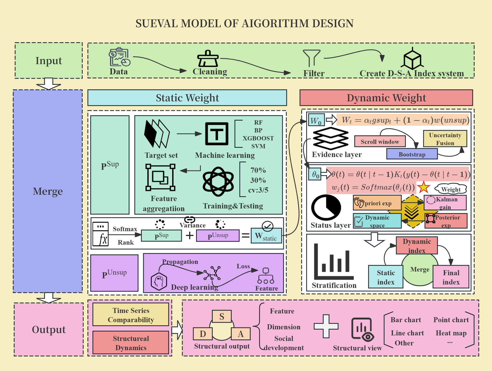

# SUEVAL: Supervised–Unsupervised Evaluation Framework

SUEVAL (Supervised–Unsupervised Evaluation) is a **D–S–A based dynamic evaluation framework** that fuses supervised and unsupervised information to build **time‑comparable, structurally decomposed, and interpretable composite indices**.


---

## 🔍 Key Ideas

- **D–S–A structure**
  - **D – Dimension:** Indicator dimensions  
  - **S – Subsystem:** Aggregated subsystems  
  - **A – Agent/Scenario:** Objects or scenarios being evaluated  
  - Hierarchical aggregation: indicators → dimensions → subsystems → final index, with structural outputs at each level.

- **Supervised + Unsupervised fusion**
  - Supervised part learns feature importance from labeled targets (e.g., performance scores).
  - Unsupervised part captures variance, correlations, and latent structures (e.g., via autoencoders).
  - Both are merged into a **static weight** \(W_\text{static}\) and further updated dynamically.

- **Dynamic weighting & time series comparability**
  - Rolling window + bootstrap for temporal and uncertainty modeling.
  - Prior–posterior (Kalman‑like) updates and softmax normalization:
    \[
    W_t = \alpha_t g_{\text{sup},t} + (1-\alpha_t) w_{\text{unsup},t}
    \]
  - Outputs time‑varying indices and structural dynamics.

- **Rich visualization & diagnostics**
  - Line / bar / scatter / heatmap plots.
  - Parallel coordinates and D–S–A structural views for interpretability.

---

## ⚙️ Dependencies
Install core dependencies:
- numpy ✅
- pandas ✅
- matplotlib ✅
- seaborn ✅
- scikit-learn (scikit-learn 1.3.0) ✅
- xgboost 2.0.3 ✅
- catboost 1.2.7 ✅
- torch 2.6.0 ✅
- statsmodels 0.14.0 ✅

## 🚀 Quick Start (Pseudocode)
This is a high‑level pseudocode example.
Class and function names are illustrative; adapt to your actual implementation.

- ### 1. Prepare data and metadata
```python 
from sueval import SUEVALModel  # hypothetical main class

--1. Load raw data

df = read_table("data/example_data.csv")

--2. Load D–S–A metadata
meta_config = read_json("data/dsa_meta.json")

--3. Create model instance
model = SUEVALModel(meta_config=meta_config)
```
- ### 2. Fit static weights
```python 
-- Separate supervised target (if available)
y = df["target"]
X = df.drop(columns=["target", "year"])  # keep only indicator columns

sup_models = [
    RandomForestRegressor(),
    XGBRegressor(),
    SVR(),
    KNeighborsRegressor(),
    DecisionTreeRegressor(),
    MLPRegressor(),
    CatBoostRegressor(verbose=0),
]

unsup_config = {
    "use_deep_autoencoder": True,
    "latent_dim": 8,
}

model.fit_static(
    X=X,
    y=y,
    sup_models=sup_models,
    unsup_config=unsup_config,
)

W_static = model.get_static_weight()
```
- ### 3. Fit dynamic weights and build indices
```python
time_index = df["year"]

model.fit_dynamic(
    X=X,
    time_index=time_index,
    window_size=5,        # rolling window
    bootstrap_iter=100,   # bootstrap per window
)

static_index = model.get_static_index()
dynamic_index = model.get_dynamic_index()
structure_out = model.get_structure_output()
```
- ### 4. Visualization (pseudocode)
```python
model.plot_time_series(dynamic_index)
model.plot_heatmap(structure_out)
model.plot_parallel_coordinates(structure_out)
```
## 🧩 Algorithm Sketch (Pseudocode)
### Static weight fusion
- INPUT:
```python
    p_sup    : supervised contributions (per indicator)
    p_unsup  : unsupervised contributions (per indicator)
```
- PROCESS:

Normalize both:
```python
    p_sup_norm   = normalize(p_sup)
    p_unsup_norm = normalize(p_unsup)
```
Fuse with a hyperparameter beta in [0, 1]:
 ```python
    p_combined = beta * p_sup_norm + (1 - beta) * p_unsup_norm
 ```
  

Softmax to get static weights:
```python
    W_static[i] = exp(p_combined[i]) / sum_j exp(p_combined[j])
```
  

- OUTPUT:
```python
    W_static : static weights for all indicators
```
### Dynamic weight update
For each time window t:

  1. Extract X_t, y_t for the window
    
  2. Under bootstrap:
        - Estimate supervised contribution g_sup,t
        - Estimate unsupervised contribution w_unsup,t  
  3. Fuse evidence:
   
     

  4. Kalman-like status update:

      
     


## 📌 Use Cases
- Regional / urban development evaluation
- Corporate performance and ESG scoring
- Education, healthcare, and social governance multi‑indicator assessment
Any composite evaluation task requiring learned **weights + temporal dynamics + structural decomposition**

## 📖 Citation & Contribution
If you use **SUEVAL** in research or applications, you may cite it as:

Lai, Yawen, SUEVAL: An integrated urban evaluation model incorporating semi-supervised temporal structures. Available at SSRN: https://ssrn.com/abstract=7148586 or http://dx.doi.org/10.2139/ssrn.7148586

## 📁 Project Structure

```text  
SUEVAL/  
├─ README.md  
├─ SUEVAL_design.png          # Model & algorithm design diagram  
├─ data/                      # Sample data & D–S–A metadata  
├─ sueval/  
│  ├─ __init__.py  
│  ├─ preprocessing.py        # Cleaning, scaling, D–S–A construction  
│  ├─ static_weight.py        # Supervised + unsupervised static weights  
│  ├─ dynamic_weight.py       # Dynamic weights & temporal updating  
│  ├─ index_builder.py        # Index construction & aggregation  
│  ├─ visualization.py        # Plotting utilities  
│  └─ utils.py  
└─ examples/  
   └─ demo_sueval.ipynb       # Usage demo  
```
